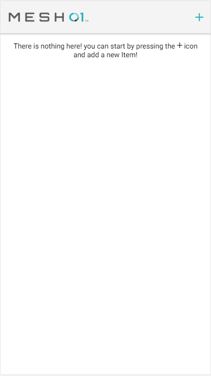
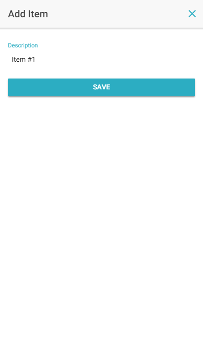
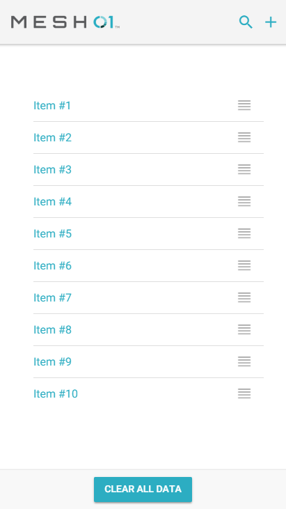
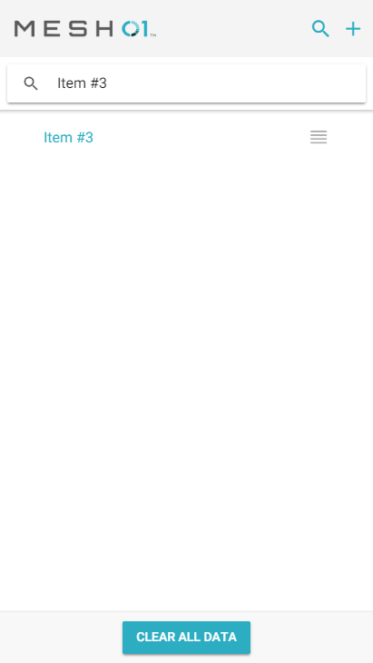
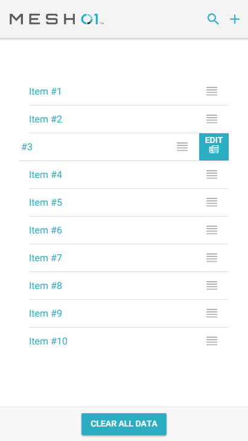
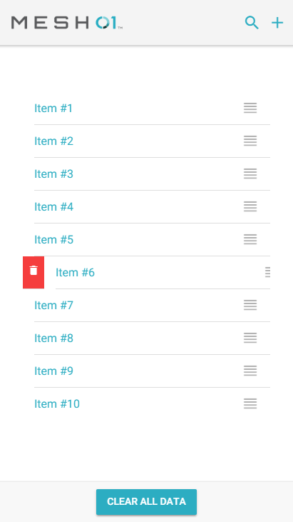

Ionic Sortable Item List
========================

1- This is the homepage. 
Once you get into the app it tells you that you need to add something to it, 
otherwise you wont see it working.

2- In the add page you can add an item. It wont allow you to create an item unless
you type something. This page is reused for the Edit.

3- Once you have 10 or more elements you'll see that the app shows a Search button on the toolbar
You can also see a Clear All button on the bottom, this button show itself once you have 
1 or more elements created.

4- SearchBar working

5- The edit button appears once you swipe an element from the list from right to the left

6- The delete buttons show itself once you swipe an element from right to the left.

7- You can grab any element from the list and reordering,
 the reorder will be saved on real time on the database.

